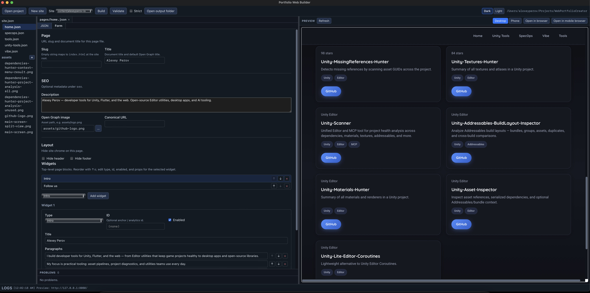

# Portfolio Web Builder

This project can be either used to create a website without coding at all or as a foundation for you to start vibe-coding a site (+ editor for it). So anyway it can help save some time and / or tokens.

Edit your site in a desktop app, build static pages, and preview them locally before publishing anywhere that hosts static files (GitHub Pages, Netlify, your own server, and more).

Each site lives in a **content folder** with simple JSON configuration, your images, and a shared design template. The app generates ready-to-upload HTML, CSS, and JavaScript.

---

---

## Install

Pre-built apps are produced on every successful build on the `main` branch.

### macOS or Windows (recommended)

1. Open the repository’s [**Actions**](https://github.com/AlexeyPerov/WebPortfolioBuilder/actions) tab (replace the owner/repo in the URL if you forked this project).
2. Select the latest green **Rust CI** workflow run.
3. Download the artifact for your platform:
   - **macOS** — `studio-macos-latest` (`.app` or `.dmg` inside the archive)
   - **Windows** — `studio-windows-latest` (installer `.msi` or `-setup.exe`)
4. Unzip the download, then install or run the app as you normally would on your system.

> **Tip:** When [GitHub Releases](https://github.com/AlexeyPerov/WebPortfolioBuilder/releases) are published, you can download installers there instead of using Actions artifacts.

### System requirements

- **macOS** 10.15 or later, or **Windows** 10/11 (64-bit)
- Enough disk space for the app and your site assets (typically tens of MB)

## Run

1. **Launch** Portfolio Web Builder.
2. Click **Open project** and choose the folder that contains both `content/` and `Template/` (for this repository, that is the repo root).
3. Pick a site from the dropdown — for example `kometa` (sample portfolio) or `demo` (widget showcase).
4. Edit pages using the **Form** or **JSON** tab in the editor.
5. Click **Build** to generate the site and refresh the built-in preview.
6. Use **Open output folder** (after a successful build) to find the generated site files for upload or hosting.

Optional toolbar features:

- **Validate** — check configuration and assets without writing output
- **Auto-rebuild** — rebuild automatically when you save files under the active site (off by default)

### Try the included examples

| Site folder | What it shows |
|-------------|----------------|
| `content/kometa/` | Full sample portfolio (apps, careers, social, multi-section home page) |
| `content/demo/` | Every supported widget across several demo pages |

### Publish your site

The build output is a normal static website. Upload the contents of your site’s output folder to any static host. For GitHub Pages, set `base_url` in `site.json` to your public site URL so share previews and canonical links are correct.

## Supported widgets

Compose each page from an ordered list of **widgets**. Layout widgets can nest other widgets inside them.

### Content widgets

| Widget | What it does |
|--------|----------------|
| **Intro** | Page heading and one or more paragraphs |
| **Cover banner** | Full-width hero image band |
| **Apps showcase** | Rich app or product cards with screenshots, descriptions, and store links |
| **Info grid** | Responsive grid of small cards (image, title, text) |
| **Images grid** | Photo or image gallery in a grid |
| **Careers tabs** | Job or role listings in tabbed panels |
| **Follow us** | Row of social profile buttons |
| **Project grid** | Portfolio or project cards with images, tags, and links |
| **Media swiper** | Image carousel with swipe and keyboard navigation |

### Layout widgets

| Widget | What it does |
|--------|----------------|
| **Row** | Places child widgets side by side |
| **Column** / **Columns** | Stacks child widgets vertically (both names work) |
| **Grid** | Arranges child widgets in a responsive CSS grid |

Site-wide settings (theme colors, header navigation, footer, store icons, and social links) are configured in `site.json` for each site under `content/<site-name>/`.

## Project layout (for authors)

```
content/
  <your-site>/
    site.json       # Site name, theme, header, footer, output folder
    pages/          # One JSON file per page
    assets/         # Images and icons used on the site
Template/           # Shared layout, styles, and widget designs (do not remove)
```

Generated sites are written to the folder named in `output_folder` inside `site.json` (by default under `Results/` when working in this repository).

---

**Contributors:** implementation details, CLI usage, and development setup live in [`studio/README.md`](studio/README.md) and the [`Specs/`](Specs/) folder.
